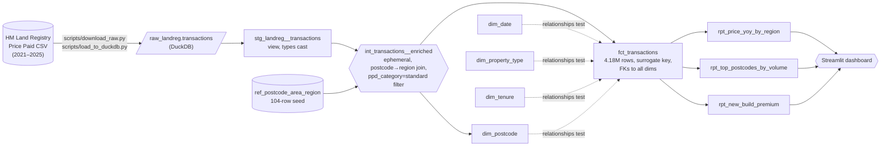

# uk-property-analytics

**Analytics-engineering portfolio piece.** A 5-year UK housing market study built on
HM Land Registry Price Paid data — every recorded property transaction in England &
Wales 2021–2025 (≈4.99M rows, ≈157 MB Parquet). Sources → staging → intermediate →
marts (dimensions / facts / reporting), tested at every layer, lineage and column-level
docs published to GitHub Pages on every push.

## Live links

- 📊 **Live dbt docs site (lineage + column catalogue):** https://rosscyking1115.github.io/uk-property-analytics/
- 📈 **Live Streamlit dashboard:** https://ross-uk-property-analytics.streamlit.app/
- ✅ **CI status:** [](https://github.com/rosscyking1115/uk-property-analytics/actions/workflows/ci.yml) — every PR runs Python unit tests, Streamlit render/browser smoke tests, source freshness, `dbt build`, 154 data tests, dashboard extract smoke tests, and sqlfluff lint. Branch protection on `main` requires the check to pass before merging.

## Architecture



## Five business questions answered

1. **Where in England & Wales has housing got more or less affordable year-on-year?**
   `rpt_price_yoy_by_region` — median + mean + YoY % per region per year.
   Headline finding: **London is the only region with a negative 2025 YoY** (-1.0%);
   every other region grew, with North West and Wales leading at +2.4%.
2. **Which postcode areas are the hottest markets, and is that ranking shifting?**
   `rpt_top_postcodes_by_volume` — DENSE_RANK on transaction count per year.
   Headline finding: the 2025 top-10 by volume contains **zero London codes** —
   Birmingham (`B`), Sheffield (`S`), and Nottingham (`NG`) lead. London volume is
   spread across many narrow areas (`E`, `EC`, `N`, `NW`, `SE`, `SW`, `W`, `WC`,
   plus outer-London codes), so single-letter codes covering whole cities outrank.
3. **What premium do new builds command over existing properties, regionally?**
   `rpt_new_build_premium` — median price gap between new and existing per region+year.
   Headline finding: **inversely correlated with regional price level.** North East:
   +61.8%. London: +8.8%. In lower-priced regions, new builds are scarce relative to
   existing stock so scarcity drives the premium; saturated London gives less room.
4. **What's the regional north-south spread, and is it widening?**
   Derived from `rpt_price_yoy_by_region`. London median (£515K) is **2.94× the North
   East** (£175K) in 2025. Spread has been roughly stable since 2022.
5. **Are arm's-length sales the whole market story?** `fct_transactions` filters to
   `ppd_category='standard'`. The excluded 16% (≈800K rows) — repossessions, BTL
   portfolio transfers, charity transfers, corrections — would drag mean price
   toward £1 and break market analyses. Filter is applied once, in the int_ layer,
   so every downstream mart inherits the discipline.

## Tech choices

| Layer | Tool | Why |
|---|---|---|
| Warehouse | **DuckDB** | Free, zero-ops, single-file, runs in CI. Whole 5-year warehouse fits in 200 MB; queries return in milliseconds. |
| Transform | **dbt-core 1.11** + **dbt-duckdb 1.10** | Industry-standard analytics-engineering tool. The version bump from the kit's 1.8 happened because by May 2026 1.11 is current stable with broader Python 3.13 wheel coverage. |
| Tests | **Built-in** + **dbt-utils** + **dbt-expectations** + **singular** | Three layers: row-shape (built-in `not_null`/`unique`/`relationships`), value-shape (dbt-utils + dbt-expectations distribution checks), and named-hypothesis (12 SQL files in `tests/`). 154 data tests total, +1 source-freshness check. |
| Docs | `dbt docs` to **GitHub Pages** | Free hosting, lineage graph, column-level catalog. See `.github/workflows/docs.yml`. |
| Dashboard | **Streamlit** | Python-native, easy DuckDB read-only connection. Free tier hosting on Streamlit Community Cloud. |
| CI | **GitHub Actions** | Two workflows: `docs.yml` publishes dbt docs to Pages on every push to main; `ci.yml` runs Python unit tests, Streamlit render/browser smoke tests, source freshness, `dbt build`, 154 data tests, dashboard extract smoke tests, and `sqlfluff lint` on every PR. Branch protection on `main` requires the CI check before merging. |
| Lint | **sqlfluff 4.1** + dbt templater | Wired via `pre-commit` (local) and as a hard CI gate. A style violation in `models/` fails the PR check, same as a failing dbt test. |

The full `requirements.txt` pins are verified May 2026 against PyPI metadata to
ensure every package has a Python 3.13 wheel — no source builds required, which
matters on Windows (Smart App Control blocks `meson` subprocess invocations
during builds).

## How to run from a fresh clone

```bash
# 1. Clone + venv
git clone https://github.com/rosscyking1115/uk-property-analytics.git
cd uk-property-analytics
python -m venv .venv
# Windows: .\.venv\Scripts\Activate.ps1   |  macOS/Linux: source .venv/bin/activate
python -m pip install --upgrade pip
pip install -r requirements.txt
dbt deps

# 2. Profile (one-time)
mkdir -p ~/.dbt
cp profiles.yml.example ~/.dbt/profiles.yml

# 3. Pull data + load + build (5-year default ~3-5 min, --sample for fast 2-year YoY run)
python scripts/download_raw.py     # use --sample for a faster 2-year run
python scripts/load_to_duckdb.py
dbt seed
dbt build
```

A fresh clone reproduces the full warehouse + 154 data tests in under 5 minutes
on a laptop. To re-publish docs locally: `dbt docs generate && dbt docs serve`.

To prepare a local official postcode lookup for the housing decision-support
prototype, keep the full upstream file out of git and normalize it into the
same contract as the committed fixture:

```bash
python scripts/prepare_onspd_seed.py path/to/onspd.zip --member "Data/*.csv" --snapshot-date 2026-05-01
```

The default output is `data/raw/ref_onspd_normalized.csv`, which is ignored by git.

## Test coverage

| Layer | Count | What it catches |
|---|---|---|
| Source freshness | 1 | Stale upstream data (warn if no rows newer than 35 days) |
| Built-in row-shape (`not_null`, `unique`, `accepted_values`, `relationships`) | 65 | Schema bugs, FK orphans, enum drift |
| `dbt-utils` (`expression_is_true`, `unique_combination_of_columns`) | 8 | Sign / range invariants, multi-column uniqueness on the reporting marts |
| `dbt-expectations` (range, regex, length, distinct, quantile, row count) | 7 | Type-cast bugs, statistical drift, format regressions |
| Singular (`tests/assert_*.sql`) | 12 | Domain-specific anomalies, including guards for non-vacuous YoY, date-spine coverage, and area-profile caveats |
| **Total** | **154** | All passing on every `dbt build`; source freshness is a separate CI gate |

## Lessons learned

Three mistakes that became the right answer the second time around. Worth banking
because they're the kind of thing that catches everyone the first time:

1. **`expect_column_distinct_count_to_equal: 10`** failed on `fct_transactions.region`.
   The data legitimately has **11** distinct values: 10 ONS regions + `'Unknown'` for
   the ~2,051 rows where the postcode didn't match the seed. The fix was to use
   `_distinct_values_to_contain_set` instead — "these 10 must be present, extras OK"
   is the right semantic. **A failing test that improves your tests rather than
   your data is still a win.**
2. **Duplicate `tests:` key in YAML silently dropped a test.** I'd added a model-level
   `expect_table_row_count_to_be_between` at the top of `rpt_price_yoy_by_region`
   without noticing the existing `unique_combination_of_columns` block at the bottom.
   YAML's parser merged the duplicates and kept only the last one. The dropped test
   read as "PASS" because it never ran. **Always check that the test count matches
   your expectation, not just that all tests pass.**
3. **The fact's surrogate key was hashing NULL postcodes the same way every time,**
   so `dbt_utils.generate_surrogate_key([postcode])` produced 735 fct rows pointing
   at the same fake postcode_key — a key that doesn't exist in `dim_postcode` (which
   filters out NULL postcodes). Wrapping the surrogate-key call in
   `CASE WHEN postcode IS NULL THEN NULL ELSE … END` makes NULL-postcode rows have
   a NULL FK; the relationships test then correctly skips them. **The relationships
   test caught a real bug; trust the test before you reach for the override.**

## Future work

- **Phase 8:** Portfolio site write-up + LinkedIn announcement
- **GH Actions Node 24 migration:** Action runners deprecate Node.js 20 by September 2026; bump `actions/*` pins as v5+ versions ship
- **Decision-grade geography:** the legacy postcode-area seed is enough for regional market analysis, but not for renter decisions. A fixture-backed MSOA/postcode geography slice now exists, plus `scripts/prepare_onspd_seed.py` for normalizing a local official lookup snapshot. The next step is to pin the first official snapshot and measure full Land Registry postcode coverage against it.
- **Multi-year refresh:** `download_raw.py` is idempotent by default and reads its default years from `dbt_project.yml`; use `--force-refresh` when you intentionally want to replace cached yearly Parquets after upstream Land Registry corrections. Once 2026 is complete, update `landreg_end_year`; the date spine derives its buffer range automatically.
- **`fct_transactions` → `incremental` when it scales:** at 4.2M rows a full table rebuild is ~5s — fine. Past ~50M rows the natural migration is `materialized='incremental'`, `unique_key='transaction_key'`, with an `is_incremental()` filter on `_loaded_at` (the loader is already idempotent on that column). See the inline comment in `models/marts/core/fct_transactions.sql`

## Source attribution

[HM Land Registry Price Paid Data](https://www.gov.uk/government/statistical-data-sets/price-paid-data-downloads),
public dataset, monthly updates. Used under the
[Open Government Licence v3.0](https://www.nationalarchives.gov.uk/doc/open-government-licence/version/3/).
Contains HM Land Registry data © Crown copyright and database right.

## Repo structure

```
.
├── .github/workflows/
│   ├── ci.yml                    # GH Actions: unit tests + Streamlit browser smoke + freshness + dbt build + 154 tests + dashboard smoke + sqlfluff
│   └── docs.yml                  # GH Actions: build dbt + publish docs to GH Pages
├── .pre-commit-config.yaml       # sqlfluff + ruff hooks (local style gate)
├── .sqlfluff                     # sqlfluff rules + dbt templater config
├── .sqlfluffignore               # paths skipped by sqlfluff (target/, dbt_packages/, etc)
├── .gitignore                    # excludes target/, raw data; re-includes slim dashboard.duckdb
├── LICENSE                       # MIT
├── PROJECT-2-KIT.md              # the original two-week sprint plan
├── README.md                     # this file
├── dbt_project.yml               # project name, paths, default materialisations
├── package-lock.yml              # pinned dbt-package versions
├── packages.yml                  # dbt-utils, dbt_expectations, dbt_date
├── profiles.yml.example          # committed; real profiles.yml is gitignored
├── requirements.txt              # Python pins, verified May 2026 for cp313 wheels
├── data/
│   └── dashboard.duckdb          # slim 3-table extract committed for Streamlit Cloud
├── dashboard/                    # Streamlit app — deployed to share.streamlit.io
│   ├── _utils.py                 # cached DuckDB connection + load helpers
│   ├── requirements.txt          # slim Streamlit deps (loose pins, see comments)
│   ├── streamlit_app.py          # home page — 3 KPIs + 3 thumbnail charts
│   └── pages/
│       ├── 1_Price_YoY_by_region.py
│       ├── 2_Top_postcode_areas.py
│       ├── 3_New_build_premium.py
│       └── 4_About.py
├── models/
│   ├── _exposures.yml            # declares the Streamlit dashboard as a downstream consumer
│   ├── staging/
│   │   ├── _models.yml
│   │   ├── _sources.yml
│   │   └── stg_landreg__transactions.sql
│   ├── intermediate/
│   │   ├── _models.yml
│   │   └── int_transactions__enriched.sql
│   └── marts/
│       ├── core/
│       │   ├── _models.yml
│       │   ├── dim_date.sql
│       │   ├── dim_postcode.sql
│       │   ├── dim_property_type.sql
│       │   ├── dim_tenure.sql
│       │   └── fct_transactions.sql
│       └── analytics/
│           ├── _models.yml
│           ├── rpt_new_build_premium.sql
│           ├── rpt_price_yoy_by_region.sql
│           └── rpt_top_postcodes_by_volume.sql
├── scripts/
│   ├── build_dashboard_db.py     # builds slim data/dashboard.duckdb from full warehouse
│   ├── check_marts.py            # spot-check helper for the rpt_ marts
│   ├── download_raw.py           # idempotent yearly Land Registry download
│   ├── load_to_duckdb.py         # Parquet → raw_landreg.transactions
│   └── prepare_onspd_seed.py     # local ONSPD-style CSV/ZIP → geography seed contract
├── seeds/
│   ├── ref_onspd_sample.csv           # tiny MSOA/postcode fixture for decision geography
│   └── ref_postcode_area_region.csv   # 104-row postcode-area → ONS-region lookup
└── tests/                         # 12 singular SQL tests, named-risk hypotheses plus spine/YoY/geography guards
    ├── assert_dim_date_continuous.sql
    ├── assert_dim_date_covers_configured_window.sql
    ├── assert_dim_postcode_outward_derived_when_postcode_set.sql
    ├── assert_dim_property_type_codes_complete.sql
    ├── assert_dim_tenure_codes_complete.sql
    ├── assert_fct_no_future_transactions.sql
    ├── assert_rpt_new_build_premium_within_bounds.sql
    ├── assert_rpt_top_postcodes_one_per_year.sql
    ├── assert_rpt_yoy_has_expected_rows.sql
    └── assert_rpt_yoy_pct_within_bounds.sql
```

## License

[MIT](LICENSE).
